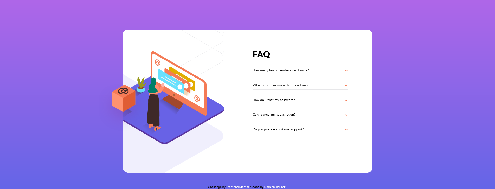
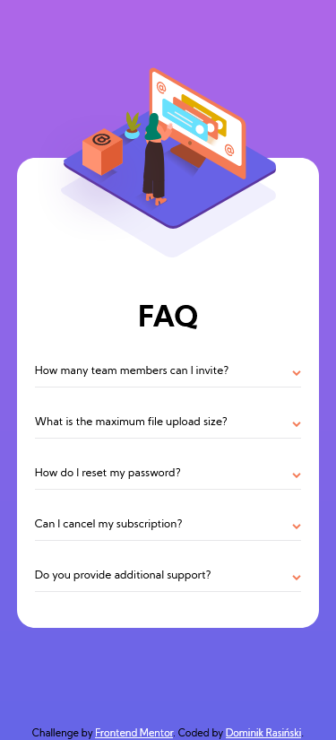

# Frontend Mentor - FAQ accordion card solution

This is a solution to the [FAQ accordion card challenge on Frontend Mentor](https://www.frontendmentor.io/challenges/faq-accordion-card-XlyjD0Oam). Frontend Mentor challenges help you improve your coding skills by building realistic projects. 

## Table of contents

- [Overview](#overview)
  - [The challenge](#the-challenge)
  - [Screenshot](#screenshot)
  - [Links](#links)
- [My process](#my-process)
  - [Built with](#built-with)
  - [What I learned](#what-i-learned)
  - [Continued development](#continued-development)
  - [Useful resources](#useful-resources)
- [Author](#author)

## Overview

- In this project I create a FAQ where users can see example solutions of qeustions.

### The challenge

Users should be able to:

- View the optimal layout for the component depending on their device's screen size
- See hover states for all interactive elements on the page
- Hide/Show the answer to a question when the question is clicked

### Screenshot

- desktop loyout:



- mobile loyout:


### Links

- Solution URL: [frontendmentor](https://www.frontendmentor.io/solutions/html5-css3-js6-mobile-first-flexbox-DXAhBxlry)
- Live Site URL: [vercel.com/dominikrasinski/faq-accordion-card-main](https://faq-accordion-card-main-blush-seven.vercel.app/)

### Built with

- Semantic HTML5 markup
- CSS custom properties
- Flexbox
- Mobile-first workflow
- JS ECMAScript 6

### What I learned

In this project I leraned how to make dynamic events in JS, and how use them in my projects.

To see how you can add code snippets, see below:

```js
const button = document.querySelectorAll('.btn-arrow');
const hiddenParagraph = document.querySelectorAll('.hiddenP');

for(const el of button){
    el.addEventListener("click", e =>{
        e.target.classList.toggle("btn-rotate");
        e.target.style.transition = '.2s';
        e.target.closest('.showP').classList.toggle('showP--fontWeight');
        showHiddenParagraph(e);
    });
}
function showHiddenParagraph(event){
    event.preventDefault();

    let paragraphVisible = event.currentTarget.closest('.showP');

    let paragraphHidden = paragraphVisible.nextElementSibling.classList.toggle("showParagraph");
}
```

### Continued development

I think in this project i created everything right, so I'm don't going about continue this project. 

### Useful resources

- [stackOverflow](https://stackoverflow.com/questions/57615247/javascript-closest-returning-null) - This article on stackOverflow helped me to understand how to create dynamic events on ```Arrays``` with elements selected by ```querySelectorAll```.
- [MDN closest](https://developer.mozilla.org/en-US/docs/Web/API/Element/closest) - This article is must have to understand, if you want make dynamic events in JS.
- [MDN nextElementSibling](https://developer.mozilla.org/en-US/docs/Web/API/Element/nextElementSibling) - Here you can learn how works ```nextElementSibling``` (I'm before reading on stackOverflow how to create dynamic events on ```Arrays```, I don't knew is exist a method ```nextElementSibling```).

## Author

- Website on vercel - [dominikrasinski](https://vercel.com/dominikrasinski)
- Frontend Mentor - [@DominikRasinski](https://www.frontendmentor.io/profile/DominikRasinski)
